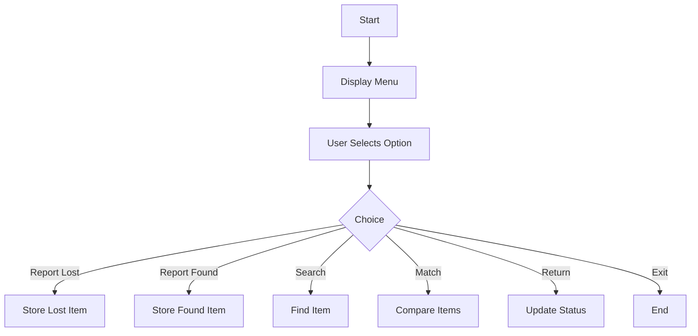

# 🌟 Lost & Found System

<p align="center">
  <b>A simple and efficient Java-based console application to manage lost and found items on campus.</b><br>
  Built using Java and Object-Oriented Programming concepts 💻
</p>

---

## 🚀 Overview

The **Lost and Found System** is a console-based Java application that helps students and staff easily report, search, and recover lost items within a campus.

It replaces traditional manual methods like notice boards and registers with a fast, digital solution.

> ⚠️ Note: This is a simple single-file Java project developed for academic purposes.

---

## ✨ Features

- 📥 Report Lost Items  
- 📤 Report Found Items  
- 🔍 Search Items by Name  
- 🔗 Match Lost & Found Items  
- 📋 View All Items  
- ✅ Mark Items as Returned (Admin)  
- 🧭 Easy Menu-Driven Interface  

---

## 🛠️ Tech Stack

- ☕ **Java**  
- 📚 **Object-Oriented Programming (OOP)**  
- 📦 **ArrayList (In-memory storage)**  
- ⚠️ **Exception Handling**  

---

## 📂 Project Structure

```text
Lost-Found-System/
│── LostFoundSystem.java
```

---

## ▶️ How to Run

### 💻 Using Terminal

```bash
javac LostFoundSystem.java
java LostFoundSystem
```

### 🧑‍💻 Using IDE

- Open the project in **VS Code / IntelliJ / Eclipse**
- Run `LostFoundSystem.java`

---

## 🧠 System Workflow



---

## 📋 Sample Menu

```text
1. Report Lost Item
2. Report Found Item
3. View All Items
4. Search Items
5. Match Items
6. Mark Item as Returned
7. Exit
```

---

## 🎯 Objectives

- Automate lost & found tracking  
- Reduce manual errors  
- Improve recovery efficiency  
- Demonstrate Java OOP concepts  

---

## 🔮 Future Enhancements

- 🗄️ Database Integration (MySQL)  
- 🖥️ GUI using JavaFX / Swing  
- 🔔 Notification system  
- 🔐 User authentication  
- 📊 Admin dashboard  

---

## 👥 Team Members

- 👤 **Godwin Laiju**  
- 👤 **Jinto P J**  
- 👤 **Meera Surendran**  
- 👤 **Nandha Kishor**  
- 👤 **Muhammed Hashim P K**  

---

## 🏫 Institution

**Vidya Academy of Science & Technology**  
📍 Thrissur, Kerala  
🎓 Department of Artificial Intelligence & Machine Learning  

---

## 🙌 Acknowledgment

We sincerely thank our project guide and faculty members for their valuable support and guidance throughout this project.

---

## ⭐ Support

If you like this project:

- 🌟 Star the repository  
- 🍴 Fork it  
- 📢 Share with others  

---

<p align="center">
  Made with ❤️ using Java
</p>
